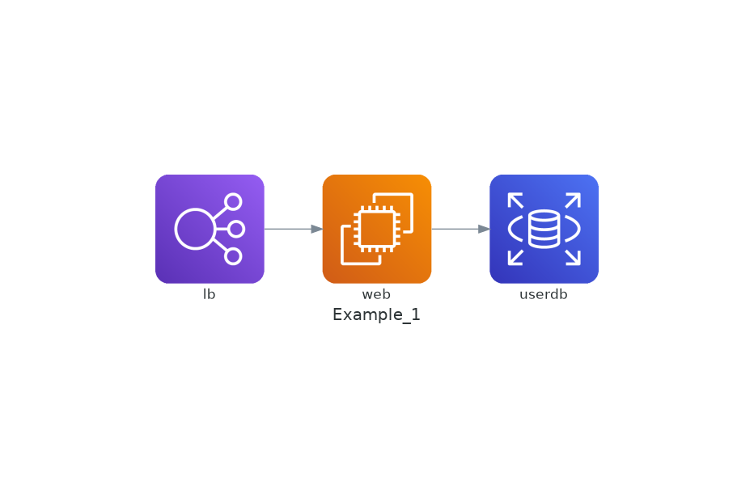

# Python - Diagrams as Code

## Installation Steps

1. Python's [diagram library](https://diagrams.mingrammer.com/docs/getting-started/installation) requires that [Graphviz](https://www.graphviz.org/download/) is installed in your system. Ensure graphviz is installed with `sudo apt install graphviz`.
2. Install with uv: `uv tool install diagrams`
3. Run with `uv run example.py`

## Example Diagrams

