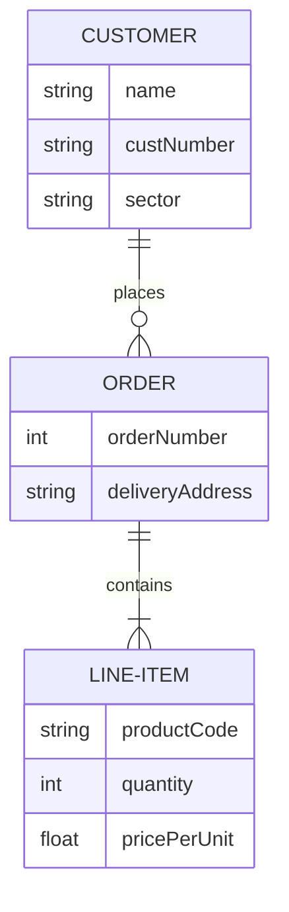
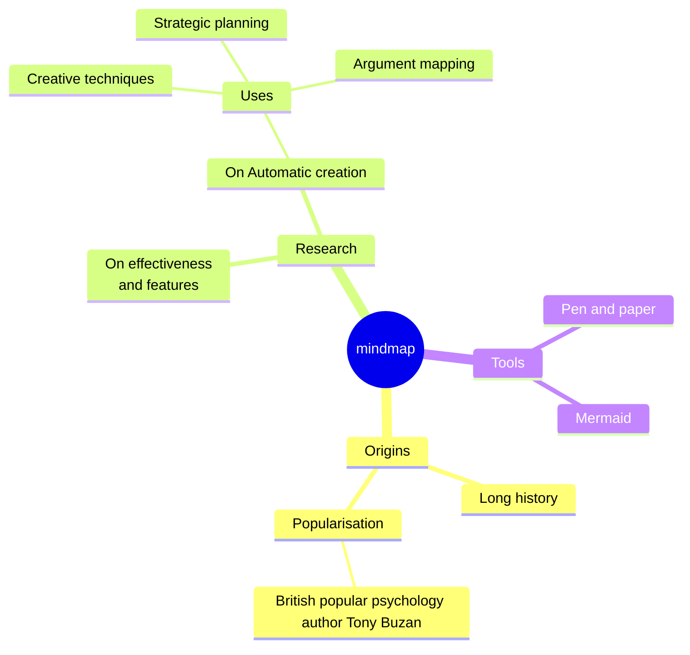

# Experimenting with Several Diagrams-As-Code Tools

These tools I experimented with (and my opinions) are:

1. [Mermaid](https://mermaid.js.org/) - my favorite. GitHub support (can appear in README.MD). Robust selection of diagrams.
2. [The Diagrams Library](https://diagrams.mingrammer.com/) robust, great for high-level architecture, but doesn't have GitHub support and may be overkill for this reason.
3. [MarkMap](https://markmap.js.org/) - good for quick, small mindmaps in particular. No GitHub support though for README.md.

Tools I did not experiment with are:

1. [PlantURL](https://plantuml.com/) - Probably the most comprehensive, but it's complex, has no GitHub support, and requires using PlantUML server, so not good for propriety cases.
2. [Hackerdraw](https://www.hackerdraw.com/) - Simpler, focused on manual drawing, doesn't integrate with GitHub.

## Benefits of Doing Diagrams-As-Code

Because the source of the diagram is in code, it means it can be

- Tracked in version control.
- Interpreted by a machine/AI. This could allow AI tools to update diagrams faster, and potentially be incorporated as a tool for writing code / changing business tooling systems as well.

### Mermaid

#### Mermaid - Entity Relationship Diagram

#### Mermaid - MindMap Diagram

## MarkMap

This is the MindMap diagram that is created from the markmap.md file:

<iframe src="markmap_example.html" width="100%" height="600" style="border:none;"></iframe>

## Mermaid Installation Steps

1. Python's [diagram library](https://diagrams.mingrammer.com/docs/getting-started/installation) requires that [Graphviz](https://www.graphviz.org/download/) is installed in your system. Ensure graphviz is installed with `sudo apt install graphviz`.
2. Install with uv: `uv tool install diagrams`
3. Run with `uv run example.py`
