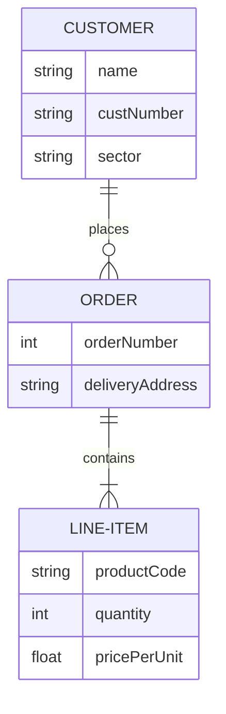
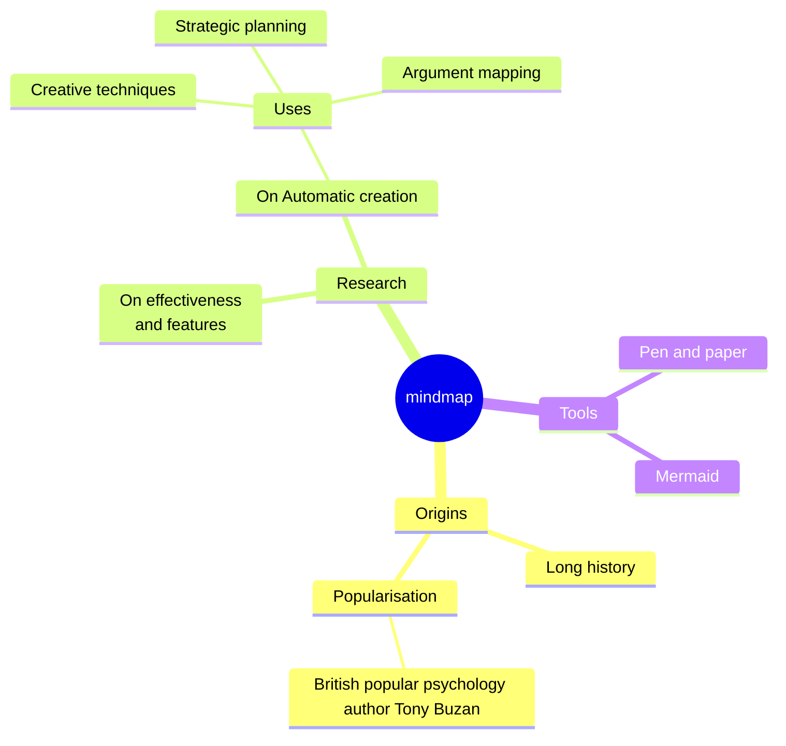
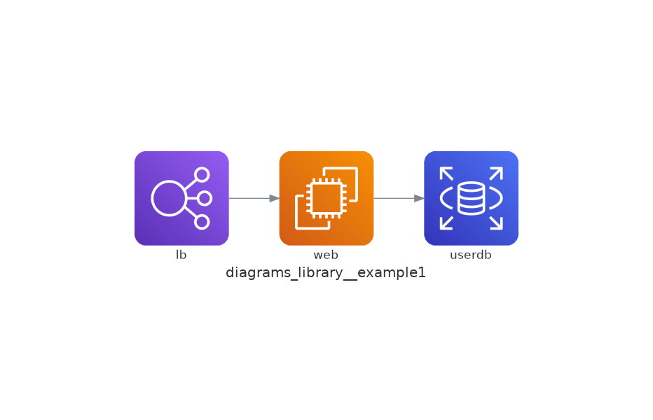
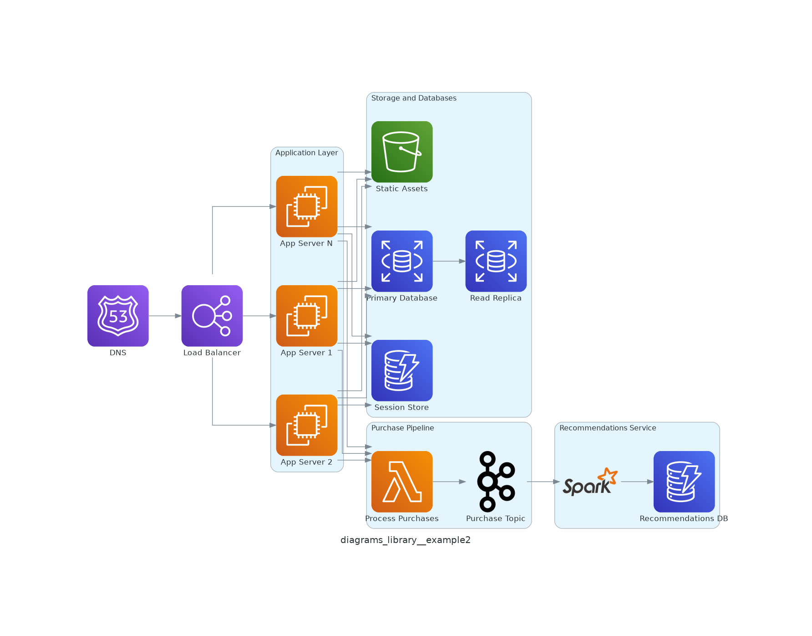

# Experimenting with Several Diagrams-As-Code Tools

These tools I experimented with (and my opinions) are:

1. [Mermaid](https://mermaid.js.org/) - my favorite. GitHub support (can appear in README.MD). Robust selection of diagrams.
2. [The Diagrams Library](https://diagrams.mingrammer.com/) robust, great for high-level architecture, but doesn't have GitHub support and may be overkill for this reason.
3. [MarkMap](https://markmap.js.org/) - good for quick, small mindmaps in particular. No GitHub support though for README.md.

Tools I did not experiment with are:

1. [PlantURL](https://plantuml.com/) - Probably the most comprehensive, but it's complex, has no GitHub support, and requires using PlantUML server, so not good for propriety cases.
2. [Hackerdraw](https://www.hackerdraw.com/) - Simpler, focused on manual drawing, doesn't integrate with GitHub.

## Benefits of Doing Diagrams-As-Code

Because the source of the diagram is in code, it means it can be

- Tracked in version control.
- Interpreted by a machine/AI. This could allow AI tools to update diagrams faster, and potentially be incorporated as a tool for writing code / changing business tooling systems as well.

### Mermaid

#### Mermaid - Entity Relationship Diagram



#### Mermaid - MindMap Diagram



## Diagrams Library

Example 1: Simple flow chart

```python
from diagrams import Diagram
from diagrams.aws.compute import EC2
from diagrams.aws.database import RDS
from diagrams.aws.network import ELB

def main():

    with Diagram("diagrams_library__example1", show=False):
        ELB("lb") >> EC2("web") >> RDS("userdb")

if __name__ == "__main__":
    main()
```



Example 2 - Architecture diagram

```python
# this was another example from the website that introduced me to this library, (https://topdeveloperacademy.com/articles/top-tools-software-architecture-diagrams-software-architects-toolbox), which is a site made by the same guy who is teaching my software architecture course.

from diagrams import Diagram, Cluster
from diagrams.aws.compute import EC2, Lambda
from diagrams.aws.database import RDS, Dynamodb
from diagrams.aws.network import ELB, Route53
from diagrams.aws.storage import S3
from diagrams.onprem.queue import Kafka
from diagrams.onprem.analytics import Spark
from diagrams.aws.integration import SNS

with Diagram("diagrams_library__example2", show=False):
    # Route53 and Load Balancer
    dns = Route53("DNS")
    lb = ELB("Load Balancer")
    dns >> lb

    # Application Cluster
    with Cluster("Application Layer"):
        app_servers = [EC2("App Server 1"), EC2("App Server 2"), EC2("App Server N")]
        lb >> app_servers

    # Storage and Database
    with Cluster("Storage and Databases"):
        db = RDS("Primary Database")
        db_replica = RDS("Read Replica")
        db >> db_replica
        cache = Dynamodb("Session Store")
        static_assets = S3("Static Assets")

    app_servers >> db
    app_servers >> cache
    app_servers >> static_assets

    # Purchase Processing
    with Cluster("Purchase Pipeline"):
        purchase_lambda = Lambda("Process Purchases")
        kafka_topic = Kafka("Purchase Topic")
        purchase_lambda >> kafka_topic

    app_servers >> purchase_lambda

    # Recommendations System
    with Cluster("Recommendations Service"):
        recommender = Spark()
        recommender_db = Dynamodb("Recommendations DB")
        kafka_topic >> recommender >> recommender_db
```



## MarkMap

The markmap.md file in this repo is the same example you can see [here in the MarkMap playground](https://markmap.js.org/repl). Here is a screenshot:


## Some additional notes

### Diagrams Library Installation Steps

1. Python's [diagram library](https://diagrams.mingrammer.com/docs/getting-started/installation) requires that [Graphviz](https://www.graphviz.org/download/) is installed in your system. Ensure graphviz is installed with `sudo apt install graphviz`.
2. Install with uv: `uv tool install diagrams`
3. Run with `uv run example.py`
